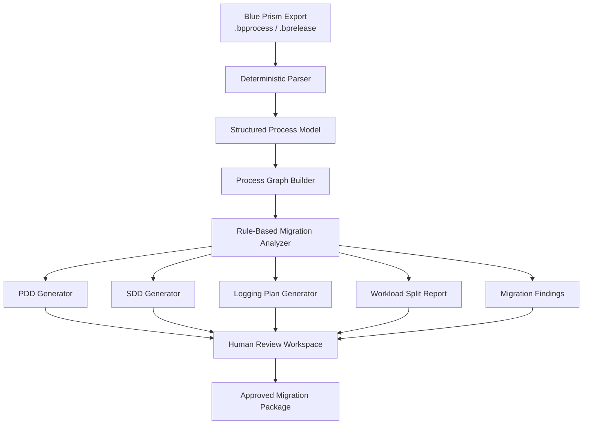

# RPA Migration Factory

**Blue Prism to UiPath migration analysis, documentation generation, and modernization planning toolkit.**

RPA Migration Factory is a proof-of-concept tool for accelerating legacy Blue Prism to UiPath migration work. It parses exported Blue Prism process files, builds a structured process model, applies deterministic migration-analysis rules, and generates first-draft PDD, SDD, logging, and workload-splitting documentation for human review.

This project is designed around a common enterprise RPA problem:

> Organizations often have legacy Blue Prism automations still running in production while moving toward UiPath as the long-term platform. Migration is slowed by limited documentation, overloaded support teams, fragile legacy processes, and the need for developers who understand both the business workflow and the automation architecture.

The goal of this project is not to automatically convert Blue Prism bots into UiPath bots.

The goal is to reduce the manual discovery burden by turning legacy process exports into structured, reviewable migration documentation that Blue Prism SMEs, UiPath developers, support teams, and business owners can all use.

---

## Project Goals

RPA Migration Factory is built to demonstrate:

* deterministic analysis of Blue Prism process exports
* generation of PDD and SDD drafts from actual process structure
* migration-readiness scoring for legacy RPA processes
* support-focused logging recommendations
* workload-splitting recommendations for daytime vs. off-hours processing
* identification of refactor/API modernization opportunities
* AI-assisted documentation drafting grounded in extracted process evidence
* human-in-the-loop review before generated documentation is treated as approved
* practical AI governance for enterprise automation workflows

---

## Why This Exists

Many enterprise RPA teams do not struggle because they lack automation tools.

They struggle because they have:

* legacy bots with incomplete or outdated documentation
* production automations maintained by a small number of platform-specific SMEs
* processes that mix business-hours work with batchable off-hours work
* logging that is either too verbose for constrained runtime environments or too limited for support teams to troubleshoot failures
* direct dependencies on legacy systems such as Access databases, Excel workbooks, or UI-only applications
* migration efforts that require people who understand both Blue Prism and UiPath
* business owners who understand the process but not the automation internals
* developers who need accurate process documentation before they can rebuild safely

This project treats migration as an engineering and documentation problem, not only a bot-building problem.

---

## Core Concept



The analyzer extracts factual process details directly from Blue Prism exports. Those extracted facts become the source of truth.

AI may optionally assist with plain-English summaries, but every generated section must be traceable to extracted evidence and reviewed by a human SME.

---

## AI-Assisted, Evidence-Grounded Design

RPA Migration Factory is designed to use AI as an accelerator for documentation and review, while keeping process evidence, deterministic parsing, and human approval at the center of the workflow.

AI can help teams move faster by drafting process summaries, improving PDD/SDD readability, identifying unclear areas, and suggesting questions for Blue Prism SMEs, UiPath developers, business owners, or support teams.

However, the analyzer does not rely on AI to invent process structure.

The factual foundation comes from parsing Blue Prism exports and building a structured process model. Rule-based analysis then identifies migration risks, logging gaps, workload-splitting candidates, and modernization opportunities. AI-assisted drafting can then turn those extracted facts and findings into clearer documentation.

```text
Deterministic extraction provides the evidence.
Rule-based analysis provides the structure.
AI-assisted drafting improves speed and clarity.
Human review provides approval and accountability.
```

This approach allows AI to empower the migration process without turning it into an uncontrolled black box. Generated documentation remains traceable, reviewable, and editable before it becomes part of an approved migration package.

---

## What This Tool Produces

Given a Blue Prism process export, the tool generates:

1. **Process Definition Document Draft**

   * business purpose
   * process trigger
   * input data
   * output data
   * systems touched
   * high-level process flow
   * business rules
   * exception paths
   * open questions for the process owner

2. **Solution Design Document Draft**

   * recommended UiPath architecture
   * queue design
   * assets and credentials
   * workflow/component breakdown
   * exception-handling approach
   * retry strategy
   * logging strategy
   * migration risks
   * support considerations

3. **Support Logging Plan**

   * minimum always-on logging fields
   * transaction correlation strategy
   * verbose logging recommendations
   * debug/replay mode recommendations
   * exception taxonomy

4. **Workload Split Report**

   * steps that likely need to run during business hours
   * steps that may be batchable off-hours
   * high-resource or low-priority candidates
   * queue deferral recommendations
   * required human validation notes

5. **Migration Assessment**

   * migration complexity score
   * business criticality flags
   * application dependency list
   * API/refactor candidates
   * Blue Prism-to-UiPath concept mapping
   * human review checklist

---

## Design Philosophy

### Evidence-grounded extraction

The parser and analyzer extract factual process details directly from Blue Prism exports.

Examples include:

* stages
* pages
* links
* decisions
* data items
* collections
* queues
* credentials
* environment variables
* exception paths
* recover/resume patterns
* hardcoded values
* wait stages
* business object calls
* application references

These extracted details become the evidence layer for the generated documentation.

### Rule-based migration analysis

The analyzer applies explicit migration and supportability rules to the extracted process model.

Examples:

* process has no detected exception path
* queue item is completed without a visible exception branch
* hardcoded file paths detected
* repeated object calls suggest a reusable component
* Access/Excel dependency detected
* long-running or batch-heavy steps detected
* UI-only data retrieval may be an API candidate
* support logging appears insufficient
* manual review step may map to UiPath Action Center
* business-hours and off-hours steps may be separable

This rule-based layer makes the analysis repeatable and auditable.

### AI-assisted documentation

AI can optionally help turn extracted facts and analyzer findings into readable documentation.

Useful AI-assisted tasks may include:

* drafting process summaries
* rewriting technical findings for business reviewers
* identifying unclear areas that need SME validation
* suggesting reviewer questions
* summarizing migration risks
* improving PDD and SDD readability
* helping translate legacy process structure into clearer UiPath design language

AI-generated sections are tied back to source evidence and marked for human review.

### Human-in-the-loop approval

Generated documentation is treated as a draft until reviewed.

A Blue Prism SME, UiPath developer, business owner, or support lead should be able to review the generated output, confirm accuracy, edit unclear sections, and approve the final migration package.

The goal is not to remove people from the migration process.

The goal is to reduce the time people spend recreating documentation from scratch so they can focus on validation, design decisions, and modernization.

---

## Example Finding

```json
{
  "ruleId": "BP-WORKLOAD-003",
  "severity": "medium",
  "title": "Candidate for off-hours workload split",
  "evidence": [
    {
      "page": "Generate Audit Report",
      "stage": "Export Monthly Reconciliation",
      "stageType": "Action"
    },
    {
      "page": "Generate Audit Report",
      "stage": "Save Report to Shared Drive",
      "stageType": "Action"
    }
  ],
  "recommendation": "Consider moving report generation and archival to an off-hours UiPath queue worker.",
  "requiresHumanReview": true
}
```

---

## Example Generated Logging Plan

Minimum logs should remain enabled even in constrained runtime environments:

| Field           | Purpose                                              |
| --------------- | ---------------------------------------------------- |
| `correlationId` | Connects all events for one process run              |
| `processName`   | Identifies the automation                            |
| `queueName`     | Identifies the work source                           |
| `queueItemId`   | Connects logs to Orchestrator queue item             |
| `businessKey`   | Human-readable process identifier                    |
| `pageName`      | Blue Prism source page or UiPath workflow            |
| `stageName`     | Current process step                                 |
| `outcome`       | Success, business exception, system exception, retry |
| `exceptionType` | Controlled failure classification                    |
| `durationMs`    | Performance and bottleneck analysis                  |
| `retryCount`    | Operational troubleshooting                          |

Verbose logs should be enabled only when:

* a transaction fails
* debug mode is enabled through configuration
* a support replay is requested
* a sampled run is selected for deeper diagnostics

---

## MVP Scope

The first version of this project focuses on a working command-line analyzer.

### MVP Features

* parse one or more Blue Prism `.bpprocess` files
* extract pages, stages, links, data items, and basic process structure
* build an internal process graph
* identify common migration risks
* detect basic workload-splitting candidates
* generate Markdown PDD draft
* generate Markdown SDD draft
* generate Markdown support logging plan
* generate Markdown workload split report
* include synthetic sample Blue Prism process files
* include clear documentation and demo output

### MVP Command

```bash
npm run analyze samples/blueprism/customer-update.bpprocess
```

### Example Output

```text
✓ Parsed process: Customer Address Update
✓ Pages discovered: 6
✓ Stages discovered: 42
✓ Links discovered: 51
✓ Data items discovered: 18
✓ Queues discovered: 2
✓ Exception paths discovered: 3
✓ Hardcoded values discovered: 4
✓ Workload split candidates: 3
✓ API/refactor candidates: 5

Generated:
- output/PDD_Customer_Address_Update.md
- output/SDD_Customer_Address_Update.md
- output/LoggingPlan_Customer_Address_Update.md
- output/WorkloadSplit_Customer_Address_Update.md
- output/MigrationAssessment_Customer_Address_Update.md
```

---

## Planned Repository Structure

```text
rpa-migration-factory/
  README.md

  docs/
    problem-statement.md
    blueprism-to-uipath-mapping.md
    pdd-template-notes.md
    sdd-template-notes.md
    logging-strategy.md
    workload-splitting-strategy.md
    human-review-model.md
    demo-script.md

  analyzer/
    src/
      cli/
      parser/
        parseBpprocess.ts
        parseBprelease.ts
      graph/
        buildProcessGraph.ts
        detectPaths.ts
      rules/
        index.ts
        exceptionRules.ts
        loggingRules.ts
        workloadRules.ts
        migrationRules.ts
        apiCandidateRules.ts
      generators/
        generatePdd.ts
        generateSdd.ts
        generateLoggingPlan.ts
        generateWorkloadSplit.ts
        generateMigrationAssessment.ts
      model/
        BluePrismProcess.ts
        ProcessGraph.ts
        AnalyzerFinding.ts
      utils/
    tests/

  templates/
    pdd.md.hbs
    sdd.md.hbs
    logging-plan.md.hbs
    workload-split.md.hbs
    migration-assessment.md.hbs

  samples/
    blueprism/
      customer-address-update.bpprocess
      access-reconciliation.bpprocess
      loan-exception-review.bpprocess
    process-json/
      customer-address-update.legacy-process.json
      access-reconciliation.legacy-process.json

  output/
    generated/

  dashboard/
    README.md
    src/

  uipath/
    UP_Migration_Intake_Assistant/
      README.md

  api/
    README.md
    src/
```

---

## Long-Term Vision

The full version of RPA Migration Factory could include:

### Analyzer API

A backend service that receives Blue Prism exports and returns migration documentation.

Potential endpoints:

```http
POST /api/analyze
GET /api/analysis/:id
GET /api/analysis/:id/pdd
GET /api/analysis/:id/sdd
GET /api/analysis/:id/logging-plan
GET /api/analysis/:id/workload-split
```

### Review Dashboard

A human-in-the-loop interface where Blue Prism SMEs and UiPath developers can review generated sections.

Review statuses:

* Drafted
* Needs SME Review
* Approved
* Edited
* Rejected

### UiPath Intake Assistant

A UiPath automation that:

1. Monitors an intake folder or Orchestrator queue.
2. Picks up Blue Prism export files.
3. Sends them to the analyzer API.
4. Retrieves generated documentation.
5. Creates an Action Center task for SME review.
6. Routes approved packages to a “Ready for UiPath Rebuild” queue.

### Access Database Modernization Adapter

A sample legacy data adapter that simulates an Access-backed process and demonstrates how legacy data access can be wrapped behind an API instead of being directly embedded into each automation.

### UiPath Migration Skeleton Generator

A future module that generates a starter UiPath project structure based on the analyzed Blue Prism process.

This would not be an automatic conversion engine. It would create scaffolding, queue contracts, config files, and migration checklists for a UiPath developer.

---

## Blue Prism to UiPath Mapping

| Blue Prism Concept             | UiPath Equivalent                                                 |
| ------------------------------ | ----------------------------------------------------------------- |
| Process Page                   | Workflow / XAML                                                   |
| Business Object                | Library / reusable workflow / coded component                     |
| Work Queue                     | Orchestrator Queue                                                |
| Environment Variable           | Asset                                                             |
| Credential Manager             | Credential Asset                                                  |
| Recover / Resume               | Try Catch / Global Exception Handler / REFramework exception flow |
| Mark Complete / Mark Exception | SetTransactionStatus                                              |
| Control Room                   | Orchestrator                                                      |
| Scheduler                      | Triggers / Jobs                                                   |
| Session Log                    | Robot Logs / Orchestrator Logs / external telemetry               |
| Manual decision point          | Action Center task                                                |
| Desktop/system interaction     | UI Automation activity or API replacement candidate               |

---

## Human Review Model

Generated documentation is only useful if it can be trusted.

RPA Migration Factory treats every output as a draft until reviewed.

Each generated section includes:

* source evidence
* confidence level
* reviewer status
* open questions
* migration recommendations
* notes on what cannot be safely inferred from the process export alone

Example:

```text
Section: Business Rules
Status: Needs SME Review
Confidence: Medium

Extracted Rule:
If customer tax ID is missing, the process routes the item to an exception path.

Source Evidence:
- Page: Validate Customer
- Stage: Decision - Has Tax ID?
- Branch: No
- Next Stage: Mark Item As Exception

Reviewer Note:
Confirm whether this is a hard business rule or only a data-quality exception.
```

---

## What This Project Demonstrates

This project is intended to show more than tool familiarity.

It demonstrates:

* RPA architecture understanding
* Blue Prism process structure familiarity
* UiPath migration planning
* enterprise documentation thinking
* support and operational awareness
* evidence-grounded AI usage with deterministic analysis and human review
* human-in-the-loop governance
* process modernization mindset
* API-first thinking
* ability to build tooling around RPA platforms, not only inside them

---

## What This Project Does Not Do

This project does not:

* automatically convert Blue Prism processes into production-ready UiPath automations
* claim generated PDD/SDD documents are final without SME review
* use AI as the factual source of truth
* process real banking data
* include proprietary bank workflows
* replace platform-specific developer judgment

---

## Example Use Case

A bank has a legacy Blue Prism process called `Customer Address Update`.

The process:

* reads customer update requests from a queue
* opens a legacy desktop application
* validates customer information
* checks for missing fields
* updates the customer record
* writes a confirmation file
* marks the queue item complete or exception

RPA Migration Factory analyzes the process and determines:

* the queue structure maps cleanly to UiPath Orchestrator queues
* validation and update logic should be separated into different workflows
* confirmation file generation can likely run off-hours
* direct UI-based customer lookup may be an API candidate
* logging should include customer update request ID, queue item ID, page/stage name, and exception classification
* the existing process has incomplete documentation around retry behavior

The generated migration package gives the UiPath team a starting point and gives the Blue Prism SME a faster document to review.

---

## Tech Stack

Initial implementation:

* TypeScript
* Node.js or Bun
* XML parsing
* Handlebars templates
* Markdown document generation
* Mermaid diagram generation
* Vitest or Jest for tests

Planned extensions:

* Hono API
* React dashboard
* SQLite/Postgres for analysis history
* UiPath process for intake orchestration
* optional AI-assisted drafting layer

---

## Roadmap

### Phase 1 — MVP Analyzer

* [ ] Parse `.bpprocess` files
* [ ] Extract pages, stages, links, and data items
* [ ] Build internal graph model
* [ ] Generate Mermaid process diagram
* [ ] Apply initial migration-analysis rules
* [ ] Generate PDD draft
* [ ] Generate SDD draft
* [ ] Generate support logging plan
* [ ] Generate workload split report
* [ ] Add sample process exports
* [ ] Add unit tests

### Phase 2 — Migration Intelligence

* [ ] Add migration complexity scoring
* [ ] Add Blue Prism-to-UiPath mapping report
* [ ] Detect reusable component candidates
* [ ] Detect API modernization candidates
* [ ] Detect Access/Excel dependencies
* [ ] Add confidence and evidence model
* [ ] Add reviewer questions per finding

### Phase 3 — Review Dashboard

* [ ] Add analysis history
* [ ] Add document review interface
* [ ] Add approve/edit/reject workflow
* [ ] Add reviewer notes
* [ ] Add export package generation

### Phase 4 — UiPath Intake Assistant

* [ ] Build UiPath intake flow
* [ ] Monitor folder or Orchestrator queue
* [ ] Submit files to analyzer API
* [ ] Retrieve generated outputs
* [ ] Create Action Center review task
* [ ] Route approved packages to rebuild queue

### Phase 5 — Optional AI Drafting

* [ ] Add AI-assisted summary generation
* [ ] Label all AI-generated content
* [ ] Require evidence references
* [ ] Require human approval before export
* [ ] Add token/cost control settings

---

## Current Status

This project is in early design and MVP planning.

The first milestone is a command-line analyzer that can parse a sample Blue Prism process and generate draft migration documentation.

---

## Author

Built by Clifton Choiniere IV as an RPA modernization portfolio project demonstrating the intersection of:

* Blue Prism
* UiPath
* enterprise automation
* software engineering
* process documentation
* migration tooling
* supportability
* API-first modernization
* human-in-the-loop review
